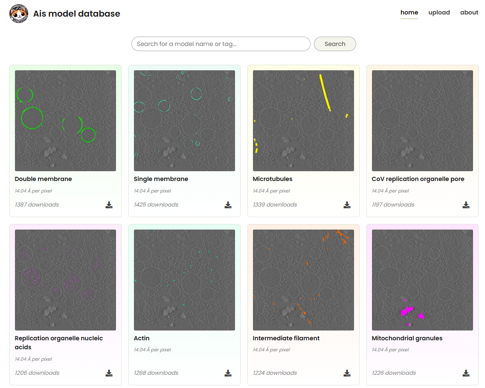

# Sharing models

Trained models can be shared via the Ais model repository at [aiscryoet.org](https://www.aiscryoet.org). Here you can upload a trained model, or download models that were prepared by others. Previously trained models can be a useful starting point for your own training.

Generally, we've found that Ais models *do not generalise well at all* - that's why [easymode](https://mgflast.github.io/easymode/) exists. A model trained on just one dataset tends to be specific to that dataset's parameters - pixel size, sample type, reconstruction and preprocessing methods, etc.; [a network trained on many different datasets, however, does generalise](https://mgflast.github.io/easymode/models/). Still, if you happen to work with some specific tomogram flavour - e.g. etomo SIRT-like filtered 8 Å/px tomograms - and someone has already trained a model for that, that could be a useful download.

The model repository at <a href="https://www.aiscryoet.org">aiscryoet.org</a>.

## What's in a model file?

Before considering publicly sharing a model, you might want to know what exactly it is that you would be sharing. An Ais model (.scnm) file is essentially a renamed .tar archive that contains up to four separate files: a `.h5`, which is the network weights, a `.json` with metadata, and optionally also a `.tiff` and `.png`, if you saved the model from the GUI while a tomogram was open. The `.tiff` is a single tomogram slice, of whatever slice you were looking at when you saved the model; the `.png` is that slice plus an overlay of what your model's output was like for it. Other than this, nothing is shared, and people can not reconstruct your data from the model weights. If you want, you can unpack the `.scnm`, delete the `.tiff` and `.png`, then tar it back up and rename it `.scnm` before uploading.

## Curated general pretrained networks - easymode
Easymode is a curated library of general pretrained networks, trained on the easymode training data collection which comprises over 4,500 tilt series from 70 unique datasets and 30+ different species. The library currently contains around 20 networks for segmentation of common cellular components, such as ribosomes, membranes, cytoskeletal filaments, mitochondria, the cytoplasm, etc. *If you just want labels and don't really care to train your own network, we recommend using easymode*. Or if you wouldn't mind training your own but mostly you just want segmentations and to get on with the biology, go for easymode too. 

  

