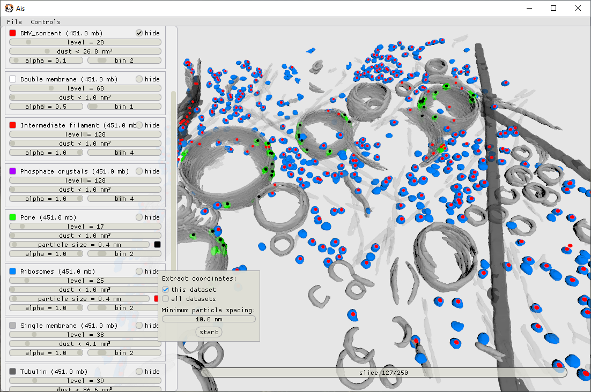

# Using a model

Once you have a model you're happy with, you use it to segment your whole dataset and to pick particles. Both run from the command line (small tests can also be done in the GUI). When segmenting structures that you want to do subtomogram averaging on, resulting segmentations can be turned into coordinates using [`ais pick`](../cli/reference.md#ais-pick). You can also combine segmentations for multiple different features. For example, if you segment and pick ribosomes, and segment mitochondria, you could combine the two to select a subset of mitochondrial ribosomes. For this, use `pom contextualize` — see [Pom](https://github.com/mgflast/Pom).

We include some more details about visualisation and picking strategies below.

## Visualisation

Ais also contains a built-in 3D isosurface renderer, which is very similar to the isosurface renderer in ChimeraX. You can use it to quickly screen segmentation outputs on various tomograms.

<video controls muted loop autoplay playsinline width="100%">
  <source src="../../res/render_3d.mp4" type="video/mp4">
</video>

In the Render tab in Ais, segmentations belonging to a tomogram are automatically detected and displayed in 3D. In this example we inspect microtubule (yellow) and microtubule inner protein (blue) segmentations.

For large scale automated visualisation, use [Pom](https://github.com/mgflast/Pom). Pom uses the Ais rendering engine, and can do isosurface and volumetric rendering. You can run it on a HPC cluster and rapidly generate all sorts of visualisations for hundreds of tomograms.

<!-- Video 2 from the Pom README goes here. -->

## Picking particles

Once you have segmentations, you turn them into particle coordinates. Small jobs run in the GUI; whole datasets run from the command line.

### In the GUI

Open a tomogram and switch to the **Render** tab (`4`). Ais loads the segmentations belonging to that tomogram automatically, matching them by filename: a `Ribosome` segmentation of tomogram `TS_001` is expected at `TS_001__Ribosome.mrc`. If yours live elsewhere, point Ais at that directory.

Right-click a feature's panel to open its picking menu, set the **minimum particle spacing**, and start. Picking is watershed-based: the segmentation is split into connected regions, and each region becomes one coordinate.

The picking menu, open on the Ribosomes feature. Each region found becomes a coordinate, marked here with a dot.

Globular particles — ribosomes, pores — pick predictably. Irregular or loosely separated shapes are harder: set the spacing too low and a single particle splits into several.

!!! tip
    Tune the spacing on one tomogram first. Once it looks right, apply the same value across the batch.

### On a cluster

For whole datasets, use [`ais pick`](../cli/reference.md#ais-pick) from the command line. It reads the segmentation `.mrc` files and writes RELION-style `.star` coordinate files, with a **blob** mode for compact particles and a **filament** mode for filaments such as microtubules. The command reference has the options.

## Need help?
I (Mart) would be happy to think along and help troubleshoot your workflow. In my experience, segmentation can be a super powerful way to get around large datasets and work through picking problems. But with cryoET being such a fragmented software landscape, it can be difficult to figure out exactly which other tools you'll need and how to string together a workflow out of separate bits of software. Maybe the subtomogram averaging and picking tutorials in the [easymode user guide](https://mgflast.github.io/easymode/) can be of help. If you've already looked at those and still want some input, just [post an issue](https://github.com/mgflast/Ais/issues) on GitHub.