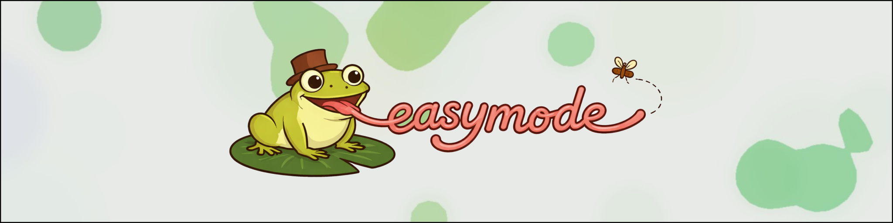

<h2 style="text-align: center; font-weight: bold;">Streamlining tomogram segmentation</h2>
<h3 style="text-align: center; font-weight: bold; font-style: italic;">annotate, train, and apply convolutional neural networks for visualization and particle picking</h3>

**Ais** is segmentation software for cryoET that was designed to be fast, intuitive, easy, and fun to use. Manually annotate a small section of your data, train a neural network in a few minutes, and apply the networks to segment your entire dataset, visualise, pick particles, or contextualize particle sets.

<video controls muted loop autoplay playsinline width="100%" style="margin-top: 1em;">
  <source src="res/training_run.mp4" type="video/mp4">
</video>

Train &amp; watch a model learn to segment your own data. Ais handles annotation, training, curation, batch segmentation, and particle picking.

Check out our other tools:

  
  

